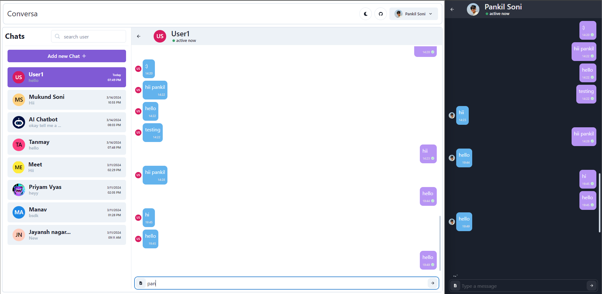

# Conversa: MERN Chat App


## 🚀 Overview
Conversa is a modern, full-featured real-time chat application built with the MERN stack (MongoDB, Express.js, React, Node.js). It supports 1:1 and group messaging, media sharing, authentication, and more—all with a beautiful, responsive UI.

---

## 🌟 Features

- **Real-Time Messaging:** Instant chat with WebSocket (Socket.io) support.
- **User Authentication:** Secure signup/login with JWT and OTP verification.
- **1:1 & Group Chats:** Create personal or group conversations.
- **Media Sharing:** Send images, audio, and files in chat.
- **Message Deletion:** Delete messages for everyone or just yourself.
- **Typing Indicators:** See when others are typing.
- **Online Status:** Know who is online in real time.
- **Search:** Find users and conversations quickly.
- **Responsive UI:** Works seamlessly on desktop and mobile.
- **Profile Management:** Update your profile, avatar, and settings.
- **Notifications:** Get notified for new messages and events.
- **Audio Notifications:** Custom sound for new messages.
- **Secure Backend:** All sensitive data is protected and never exposed.
- **Deployment Ready:** Easily deployable to Vercel (frontend) and Render (backend).

---

## 🛠️ Tech Stack

- **Frontend:** React, Context API, CSS
- **Backend:** Node.js, Express.js
- **Database:** MongoDB (Mongoose ODM)
- **Real-Time:** Socket.io
- **Authentication:** JWT, OTP
- **File Uploads:** Multer, Cloud Storage (configurable)
- **Deployment:** Vercel (frontend), Render (backend)

---

## 📸 Screenshots

| Home | Dashboard | Chatting |
|------|-----------|---------|
|  |  |  |

---

## 🚦 Getting Started

### 1. Clone the Repository
```bash
git clone https://github.com/ConversaPro/Conversa.git
cd Conversa
```

### 2. Setup Backend
```bash
cd backend
npm install
# Add your MongoDB URI and secrets in secrets.js or .env
npm start
```

### 3. Setup Frontend
```bash
cd ../frontend
npm install
npm start
```

---

## 🌍 Deployment

### Frontend (Vercel)
- Import the repo to Vercel.
- Set the project root to `frontend`.
- Deploy and get your live URL.

### Backend (Render)
- Create a new Web Service on Render.
- Set root to `backend`.
- Add environment variables (MongoDB URI, JWT secret, etc).
- Deploy and get your API URL.

### Update API URLs
- In the frontend, update API endpoints to use your Render backend URL.

---

## 🔒 Environment Variables

Backend (`backend/secrets.js` or `.env`):
- `MONGO_URI` – MongoDB connection string
- `JWT_SECRET` – JWT secret key
- `OTP_SECRET` – OTP secret (if used)
- `CLOUD_STORAGE` – (optional) for media uploads

Frontend:
- `REACT_APP_API_URL` – URL of your backend API

---

## 🤝 Contributing

Pull requests are welcome! For major changes, please open an issue first to discuss what you would like to change.

---

## 📄 License

This project is licensed under the MIT License.

---


## 👨‍💻 Made By

- **Riya Sharma**  
	[linkedin.com/in/riya-sharma-5a7030284](https://linkedin.com/in/riya-sharma-5a7030284)
- **Sarthak Nag**  
	[linkedin.com/in/sarthak-nag-b91861291](https://linkedin.com/in/sarthak-nag-b91861291)

---

## Credits

- Built by ConversaPro Team
- Special thanks to all contributors and open-source libraries used.

---

## 💬 Contact & Support

- [GitHub Issues](https://github.com/ConversaPro/Conversa/issues)
- Email: support@conversapro.com

---

> "Connecting people, one message at a time."
